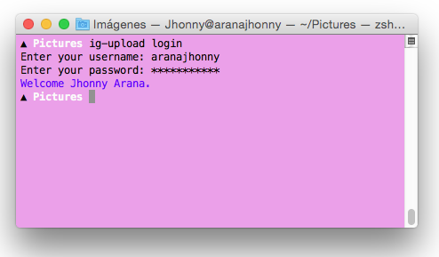
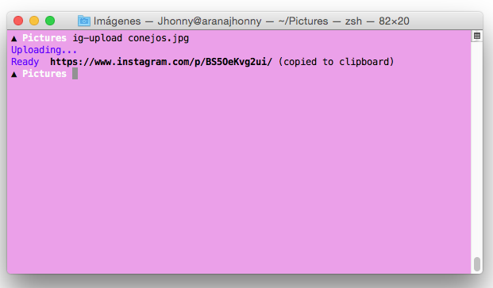

# ig-upload [WIP]

[](https://github.com/prettier/prettier)

A tiny command line tool for upload images to instagram, using [Unoficial API](https://github.com/huttarichard/instagram-private-api/).

>login



>upload



## Installation

Install using npm:
```
npm install -g ig-upload
```
or yarn
```
yarn global add ig-upload
```
## Usage

```bash
ig-upload [command] || [filename ...]
```
### Comands
```
  logout - login and remove session
  login - login and create session
  upload - upload images or videos
  help - display help
```
## Caution

Note that I am not a master doing CLI applications. I'm learning and I needed this. Possibly the code sucks.

## Authors

- Jhonny Arana ([@aranajhonny](https://twitter.com/aranajhonny))

## Please

> You will not use this repository for sending mass spam or any other malicious activity
